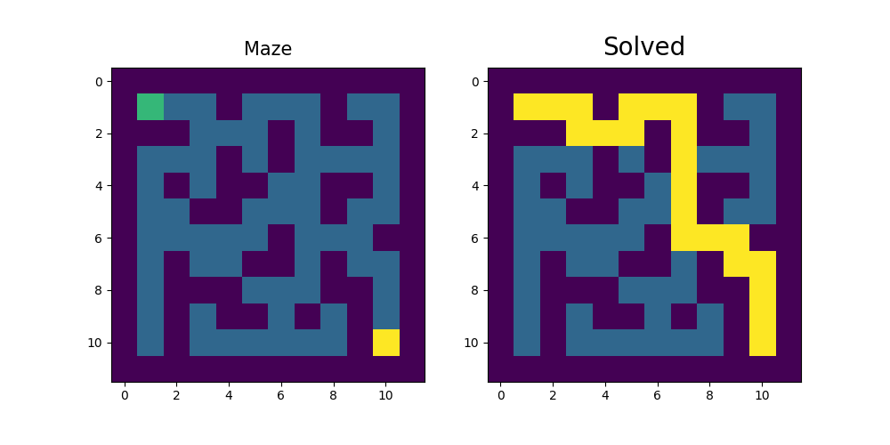
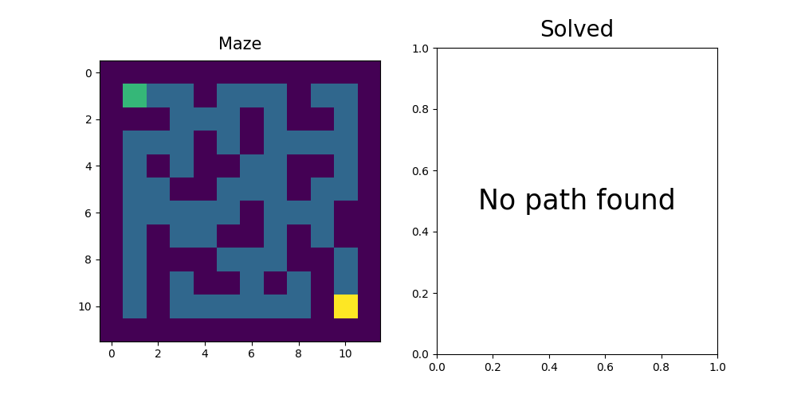

# Maze solver
> App for solving simple mazes using a genetic algorithm

## Table of contents

- [Introduction](#introduction)
- [Technologies](#technologies)
- [Usage](#usage)

## Introduction
This is a simple python application that uses a genetic algorithm to solve a maze.
The program takes a nested array of values [0, 1, 2, 3] as an input (where 0 - wall, 1 - path, 2 - start, 3 - finish)
and prints the same maze with its solved path.

## Technologies

- python - v3.7
- numpy- v1.21.5
- pygad - v2.16.3
- matplotlib - v3.5.1

## Usage
Use the `solve_maze(maze, start, finish)` function to generate a solution for a given maze.
<br>
Parameters:
- **maze** : *array, format: [[], ..., []]*
- **start** : *dict, format: {"x": your_x, "y": your_y}*
- **finish** : *dict, format: {"x": your_x, "y": your_y}*

``` Python
solve_maze([[0, 0, 0, 0, 0, 0, 0, 0, 0, 0, 0, 0],
            [0, 2, 1, 1, 0, 1, 1, 1, 0, 1, 1, 0],
            [0, 0, 0, 1, 1, 1, 0, 1, 0, 0, 1, 0],
            [0, 1, 1, 1, 0, 1, 0, 1, 1, 1, 1, 0],
            [0, 1, 0, 1, 0, 0, 1, 1, 0, 0, 1, 0],
            [0, 1, 1, 0, 0, 1, 1, 1, 0, 1, 1, 0],
            [0, 1, 1, 1, 1, 1, 0, 1, 1, 1, 0, 0],
            [0, 1, 0, 1, 1, 0, 0, 1, 0, 1, 1, 0],
            [0, 1, 0, 0, 0, 1, 1, 1, 0, 0, 1, 0],
            [0, 1, 0, 1, 0, 0, 1, 0, 1, 0, 1, 0],
            [0, 1, 0, 1, 1, 1, 1, 1, 1, 0, 3, 0],
            [0, 0, 0, 0, 0, 0, 0, 0, 0, 0, 0, 0]],
             {"x": 1, "y": 1}, {"x": 10, "y": 10})
```



``` Python
solve_maze([[0, 0, 0, 0, 0, 0, 0, 0, 0, 0, 0, 0],
            [0, 2, 1, 1, 0, 1, 1, 1, 0, 1, 1, 0],
            [0, 0, 0, 1, 1, 1, 0, 1, 0, 0, 1, 0],
            [0, 1, 1, 1, 0, 1, 0, 1, 1, 1, 1, 0],
            [0, 1, 0, 1, 0, 0, 1, 1, 0, 0, 1, 0],
            [0, 1, 1, 0, 0, 1, 1, 1, 0, 1, 1, 0],
            [0, 1, 1, 1, 1, 1, 0, 1, 1, 1, 0, 0],
            [0, 1, 0, 1, 1, 0, 0, 1, 0, 1, 0, 0],
            [0, 1, 0, 0, 0, 1, 1, 1, 0, 0, 1, 0],
            [0, 1, 0, 1, 0, 0, 1, 0, 1, 0, 1, 0],
            [0, 1, 0, 1, 1, 1, 1, 1, 1, 0, 3, 0],
            [0, 0, 0, 0, 0, 0, 0, 0, 0, 0, 0, 0]],
             {"x": 1, "y": 1}, {"x": 10, "y": 10})
```

